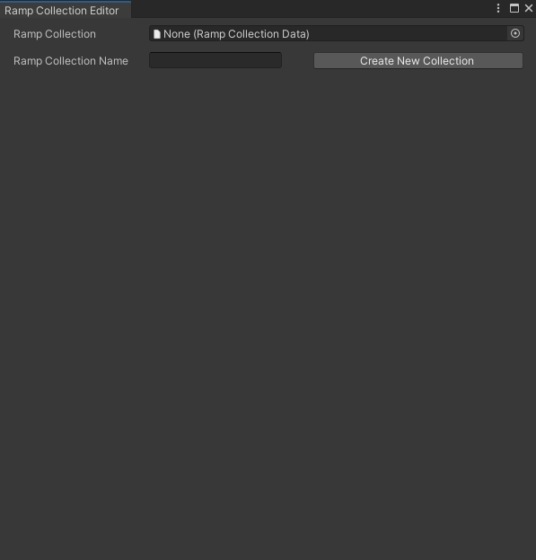

# URP Toon Shader <!-- omit in toc -->

Frustrated by the lack of up-to-date resources regarding custom lighting in Shader Graph as of yet, I decided to write my own toon lit shader for URP. This shader has been tested with Unity 2020.2.3f1 and URP 10.3.1. As of right now, it only supports transparency through alpha clipping. The following document will detail how to use the shader as well as other included tools to facilitate its usage.

## Contents <!-- omit in toc -->

- [Ramp Collections](#ramp-collections)
- [The Ramp Collection Editor](#the-ramp-collection-editor)
- [Shader Interface](#shader-interface)
  - [Shader Settings](#shader-settings)

## Ramp Collections

Much of the shader's look is driven by ramp textures, otherwise known as gradient textures. The shader depends on all ramps being packed into a single texture (or texture array) to reduce sampler usage so additional textures can be added if needed. However, the process of repeatedly editing a ramp texture in external software to make minute changes may prove cumbersome. To mitigate this nuisance, this package introduces Ramp Collections: an asset containing data from which ramp textures can be generated via the [Ramp Collection Editor](#the-ramp-collection-editor). Ramp Collections consist of the following data:

- Ramp resolution: the width in pixels of the generated ramp textures. Naturally, higher resolutions will result in larger textures, as well as higher precision when sampled in the shader.
- Row height: the height in pixels of each ramp in an atlas generated from the Ramp Collection. Enter values above one to pad out each ramp in the generated ramp texture, which may help mitigate filtering bleed-through when sampling the texture in the shader.
- Gradient list:

## The Ramp Collection Editor

The Ramp Collection Editor is an editor window made to assist in managing and generating ramp textures from Ramp Collections. It can be accessed via the editor toolbar under Window > Ramp Collection Editor, as shown below:

Upon opening the Ramp Collection Editor, you will be met with the following screen:

To begin editing a Ramp Collection, either provide a name and press the "Create New Collection" button, or place a Ramp Collection asset in the Ramp Collection field. If the Ramp Collection Name field is left blank when a new Ramp Collection is created, a default name will be provided.

Once a Ramp Collection is selected or created, you will be able to edit its various fields. Do note that the gradient list cannot be reordered, despite appearing as though it can.

## Shader Interface

The shader parameter UI is comprised of several sections, many of which can be disabled to reduce clutter in the interface.

### Shader Settings

This section controls several overarching 