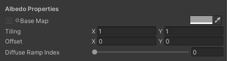

# URP Toon Shader <!-- omit in toc -->

The following document will detail how to use the shader as well as other included tools to facilitate its usage.

## Contents <!-- omit in toc -->

- [Ramp Collections](#ramp-collections)
- [The Ramp Collection Editor](#the-ramp-collection-editor)
- [Shader Interface](#shader-interface)
  - [Shader Settings](#shader-settings)
  - [General Properties](#general-properties)
  - [Albedo Properties](#albedo-properties)
  - [Specular Highlighting](#specular-highlighting)
  - [Rim Lighting](#rim-lighting)

## Ramp Collections

Much of the shader's look is driven by ramp textures, otherwise known as gradient textures. The shader depends on all ramps being packed into a single texture (or texture array) to reduce sampler usage so additional textures can be added if needed. However, the process of repeatedly editing a ramp texture in external software to make minute changes may prove cumbersome. To mitigate this nuisance, this package introduces Ramp Collections: an asset containing data from which ramp textures can be generated via the [Ramp Collection Editor](#the-ramp-collection-editor). Ramp Collections consist of the following data:

- Name: the name of the collection.
- Ramp resolution: the width in pixels of the generated ramp textures. Naturally, higher resolutions will result in larger textures, as well as higher precision when sampled in the shader.
- Row height: the height in pixels of each ramp in an atlas generated from the Ramp Collection. Enter values above one to pad out each ramp in the generated ramp texture, which may help mitigate filtering bleed-through when sampling the texture in the shader.
- Gradient list: a list of each individual ramp to be output to the generated texture or texture array.

## The Ramp Collection Editor

The Ramp Collection Editor is an editor window made to assist in managing and generating ramp textures from Ramp Collections. It can be accessed via the editor toolbar under Window > Ramp Collection Editor, as shown below:

Upon opening the Ramp Collection Editor, you will be met with the following screen:

To begin editing a Ramp Collection, either provide a name and press the "Create New Collection" button, or place a Ramp Collection asset in the Ramp Collection field. If the Ramp Collection Name field is left blank when a new Ramp Collection is created, a default name will be provided.

Once a Ramp Collection is selected or created, you will be able to edit its various fields. Do note that the gradient list cannot be reordered, despite appearing as though it can.

## Shader Interface

The shader parameter UI is comprised of several sections, many of which can be disabled to reduce clutter in the interface.

### Shader Settings

This section controls several overarching parameters of the shader.

- Use Normal Map: toggles the usage of normal maps in the shader.
- Specular Highlighting: toggles specular highlights and the [Specular Highlighting](#specular-highlighting) section.
- Rim Lighting: toggles rim highlights and the [Rim Lighting](#rim-lighting) section.
- Use Ramp Array: toggles betwen using textures and texture arrays for the ramps.
- Alpha Clipping: toggles alpha clipping and the Alpha Clip Threshold setting.

### General Properties

This section contains general properties of the shader that don't fit any particular category. By default, it contains the following:

- Ramp Atlas: input for a texture atlas containing ramps generated by the [Ramp Collection Editor](#the-ramp-collection-editor) or other sources.
- Ramp Row Height: the height in pixels of each row in the atlas.

If "Use Ramp Array" is enabled, the Ramp Row Height property is omitted and the Ramp Atlas property is replaced by a Ramp Array property:

If "Use Normal Map" is enabled, a Normal Map texture property is displayed in addition to the other properties in the section:

### Albedo Properties

This section contains properties relating to the material's color.

- Base Map: the color texture to be applied to the material. A color tint may also be selected.
- Tiling and Offset: UV tiling and offset for the base map. (Note: tiling and offset values will apply to the base map as well as the normal map. Separate tiling and offset for different maps is not supported at this time.)
- Diffuse Ramp Index: the row containing the ramp intended to be used as the diffuse ramp, counted up from zero.

If "Alpha Clipping" is enabled, an Alpha Clip Threshold property is displayed in addition to the other properties in the section. This indicates the value to be used as a threshold for the shader to determine if a particular pixel's alpha value is low enough to be clipped:

### Specular Highlighting

This section contains properties relating to specular highlights.

- Specular Map: the material's specular mask (Note: tiling and offset values from the Albedo Properties section will apply to the base map as well as the specular map. Separate tiling and offset for different maps is not supported at this time.)
- Specular Ramp Index: the row containing the ramp intended to be used as the specular ramp, counted up from zero.
- Smoothness: controls the size of the specular highlight;
- Specular Opacity: blends between the specular highlight color and the base map color.
- Specular Brightening: lightens the color of the specular highlight, useful to make the highlight from particularly dark-colored lights stand out.

### Rim Lighting

This section contains properties relating to rim lighting: the stark highlight typically observed when a subject is lit with a particularly bright light from a sharp angle. However, this shader can apply rim highlights to a subject regardless of the light's intensity.

- Specular Ramp Index: the row containing the ramp intended to be used as the rim ramp, counted up from zero.
- Rim Factor: constrains the spread of the rim highlight. Lower values will allow the rim light to spread further towards the center, making the highlight larger.
- Rim Light Opacity: blends between the rim highlight color and the base map color.
- Rim Brightening: lightens the color of the rim highlight, useful to make the highlight from particularly dark-colored lights stand out.
- Rim View Angle Curve: controls the relation between the viewing angle and the rim effect. Points closer to the right side of the curve influence the prevalence of the  rim effect when the view direction and light direction are more opposed, whereas points closer to the left side of the curve influence the prevalence of the effect when the directions are more aligned. For instance, with regards to point lights, the right side of the curve would influence the effect when the camera is facing away from the light, and the left side would influence the effect when the camera is facing towards the light. Typical curves resemble a downward slope going from one to zero.

